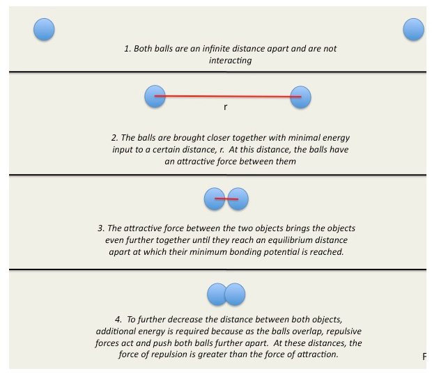

The Lennard-Jones potential is a mathematically simple model that approximates the interaction between a pair of neutral atoms or molecules. A form of the potential was first proposed in 1924 by John Lennard-Jones.This potential is a combination of both the attractive and repulsive part forces present between the atoms. Assuming an atom at the infinite distance approaches the another atom,the energy is zero when they are present at the infinite distance. As the, distance between them decreases energy reaches a minium and then increases rapidly.
The figure below shows what happens when we bring the atoms closer from an infinite distance.we can imagine atoms to be like balls.

