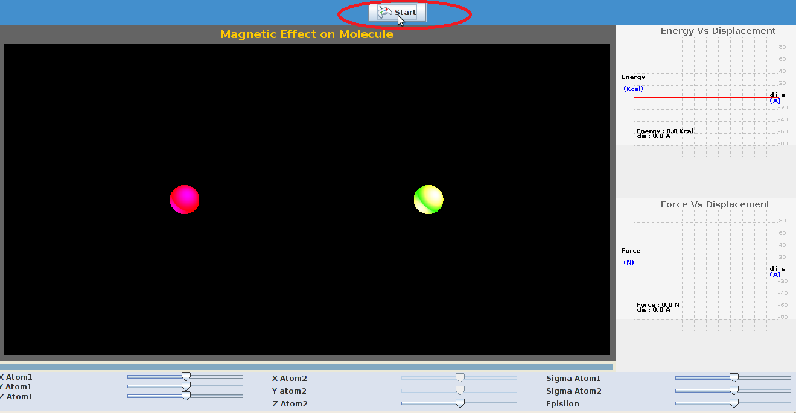
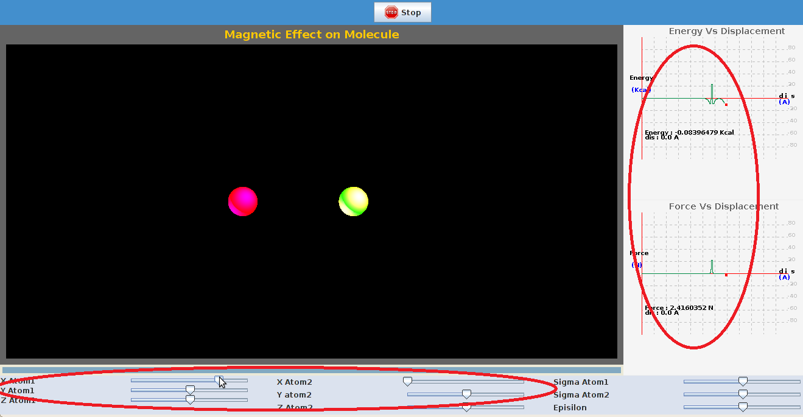
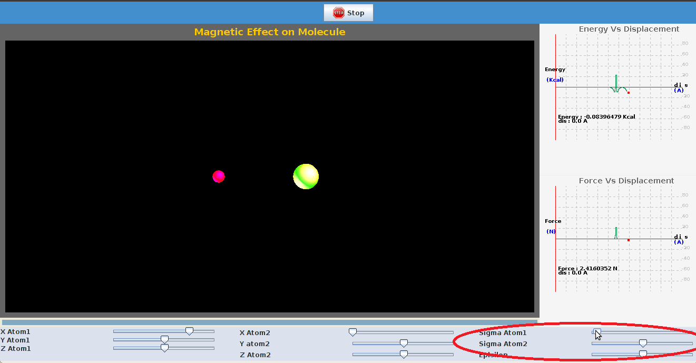

There are certain parameters to be initialized and the procedure detailed here can be followed. 

STEP 1: Click on 'start' to start the experiment.

  

STEP 2:The coordinates of particles can be varied by changing the position of sliders,a plot of energy ,force is seen. 

STEP 3: Sigma factor for both the particles can be increased or decreased by moving the slider shown below.  

